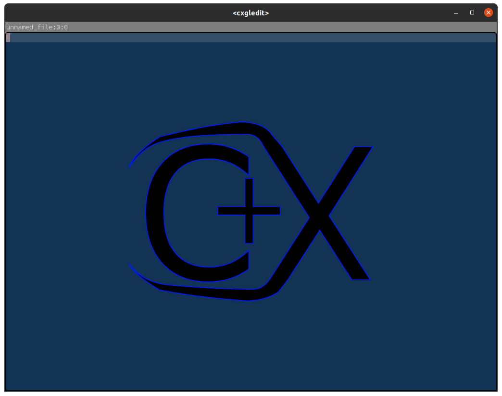
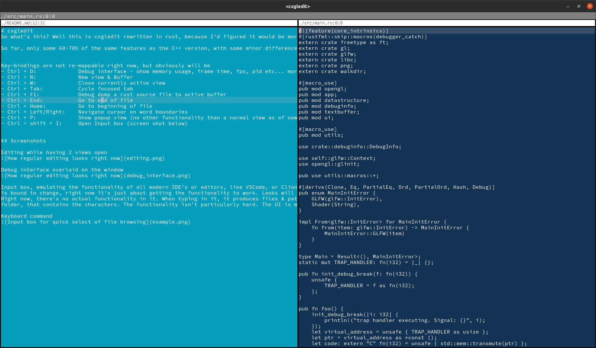
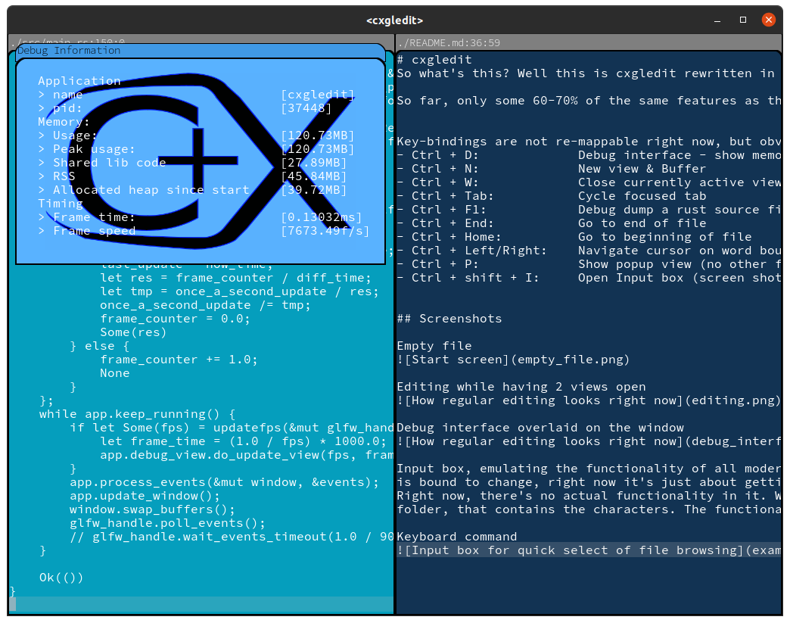
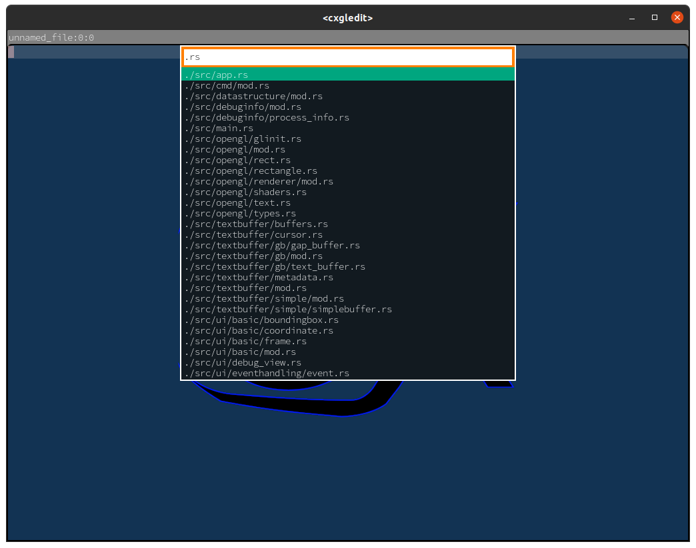

# cxgledit
So what's this? Well this is cxgledit rewritten in rust, because I'd figured it would be more fun to write in Rust. And you'll always learn something
when you do something. Text editors are pretty small in scope, unless of course you want to write massively efficient insanely fast ones. The thing is though
just writing one in C, Rust, C++, D, by default will get you a lot of speed and efficiency. So the nice thing is you can worry about optimizing later.

So far, only some 60-70% of the same features as the C++ version, with some minor differences.

Key-bindings are not re-mappable right now, but obviously will be

## General
- Select text
  - Shift + Cursor movement
  - Mouse click + drag

## View & Buffer actions 
- Debug interface, show memory usage, frame time, fps, pid etc... more to come here
  - Ctrl + D
- New view & Buffer
  - Ctrl + N
- Close currently active view
  - Ctrl + W
- Cycle focused tab
  - Ctrl + Tab
- Move Text View To another view's position
  - Ctrl + Mouse click & drag
  - Mouse click on title bar and drag
- Open Input box for opening files in current working directory (gif/screenshots below)
  - Ctrl + shift + I
- Debug dump a rust source file to active buffer
  - Ctrl + F1
- Save file
  - Ctrl + S, writes changes to disk if file exists, otherwise shows a file dialog
    The file dialogue uses the C library nativefiledialogs (with the Rust binding here, nfd-rs).
    The issue I have with it, is that as soon as one opens a dialogue, over 500 MB of Virtual memory
    gets mapped to the user process. Now, if one hits ctrl+D to show the debug info, one can see
    that the RSS (actual pages in memory) is not this high. But it still feels weird to me,
    that the library is asking for that much memory, for no apparent reason. Once the dialog is closed
    this VM does not get unmapped, either. I wonder what kind of performance issues this can cause (if any at all),
- Undo/Redo
  - (Ctrl / Ctrl + Shift) + Z
## Navigating the text buffer
- Go to end of file
  - Ctrl + End
- Go to beginning of file
  - Ctrl + Home
- Navigate text on source code block boundary
  - Shift + Alt Left/Right
- Navigate text on "word" boundary
  - Ctrl + Left/Right'
- Navigate text on page boundary
  - Page Up/Down
- Navigate text in line steps
  - Arrow Up/Down

## Misc
- Ctrl + Shift + P: Show commands (currently only 4; open, save file, go to line and find in file). These can be bound and configured to whatever key bindings we want, and this is done programmatically in [keybindings.rs](src/cmd/keybindings.rs) or in a raw JSON format, that is meant to be improved upon.

## Code quality
I have to be very clear and say that the quality of this code, how it's designed, is particularly awful. That mostly has to do with my inexperience
with writing applications that deal directly with OpenGL. Therefore most of the stuff becomes hack and slash (and I do mean, wild, hack and slash) to
get it working, and once I've done that, start thinking about architecturing the design. (one example of this hack-n-slash-then-design, is what I
did with DrawCommandList in [the polygon renderer](src/opengl/rectangle.rs))

### Todos (both complex & simple basic features)
- [ ] Syntax highlighting, using something like the regex crate which has been added to the [cargo configuration](Cargo.toml)
- [ ] Todo source code parser. Scan documents for todo comments and present them in some nice way
- [x] Buffer can now be hashed for comparison to saved contents, if the buffer is pristine / restored.
      etc.
- [ ] LINE WRAPPING. This. Must. Be. Done. Soon. Without it, the editor is bad.
- [x] Selecting text, with mouse and keyboard & rendering the selection properly.
- [x] Other search / go to features (probably also using the regex crate)
- [x] Configurable keys. Now the full input scheme / actions we can perform is serializable thanks to the amazing serde crate part of the rust eco system. One of the first major crates that made a big, big splash in 1.0 release of Rust. So obviously I was going to use that. Right now, the format isn't particularly human friendly, and I might go for another scheme than JSON, perhaps something like TOML will suit my needs better. But for now, it is what it is. Right now, [the default configuration will look like this](default.cfg). We can do custom string inputs bound to keys, like for instance for outputting a main function with a println statement, similar to what cargo initializes for us. If you want the example for setting it in code, it's found in the default configuration construction, [here, on line 271](src/cmd/keybindings.rs#L271). Later on we can build on this system to also create a form of macro system, which will be nice. The serialized version can also be found in default.cfg, just search for "println".
- [ ] Macro system, for inputting commands, text, in an arbitrary fashion defined by the user
- [ ] Symbol navigation. Like most things, I could start by using dependencies here, since the rust eco system is so powerful.
      One way of doing it, would be to do a really brute force approach and just scan the project, build a symbol database in an ad-hoc (and non-type safe way)
      and do it like that. No semantical analysis, nothing. Just eat_char(ch) until done, and figure out what are types, values, etc and use this to syntax highlight.
      Or, we can pull in parsers and lexers from other crates. We'll see. 
- [ ] File caching, to prevent loss of data. This can be implemented in a *host* of ways. Two things immediately comes to mind; first, keep a copy of the most up to date version of the file, as a swap, kind of like what Vim does. This introcuces a bunch of weirdness though and 
it can end up with a lot of files named .swp or something dumb like that. Another way, is to (also) keep a cached file, but instead of the latest versions, we can just keep a piece table, meaning a record of all the edits in the file. This has a few advantages as far as features go; it's easy to produce a visual diff of the files for instance, it also has another advantage, and that is, we can (maybe?) install a panic/crash handler, that at exit, just dumps the undo/redo history, since this essentially is what is going to be stored (or rather, it's exactly what will be stored) and this data is always up to date.
- [ ] Linux IPC, message queues, shared memory, all that good stuff. First I'd have to look at what rust-analyzer speaks over and really go for that first.

- UI elements
  - [ ] Scrollbars
    - [x] Vertical
    - [ ] Horizontal
  - [ ] Input box re-design for non-list display
  - [ ] Resizing individual views
  - [ ] File, symbol, or whatever browser
  - [ ] Free layout of floating windows
  - [ ] Resizing of split panels / changing ratio of split panels

## Screenshots

Some look-and-feel showing

Empty file

Editing while having 2 views open

Debug interface overlaid on the window

Input box, emulating the functionality of all modern IDE's or editors, like VSCode, or Clion etc. The design
is bound to change, right now it's just about getting the functionality to work. Looks will come later.
Right now, there's no actual functionality in it. When typing in it, it produces files & paths in the workspace
folder, that contains the characters. The functionality isn't particularly hard. The UI is my absolute weakest side.

### Bugs
Figured out that the NFD library wasn't buggy. The massive spike in VMSize has nothing to do with actual *physical* allocated memory. So VMSize really only shows how much virtual memory is addressed. The real allocation is the Resident Set Size,
which accounts for memory that can be accessed without triggering a page fault interrupt (i.e swapping into memory the pages).
So RSS is a much better metric for resource/memory usage.

Keyboard command
