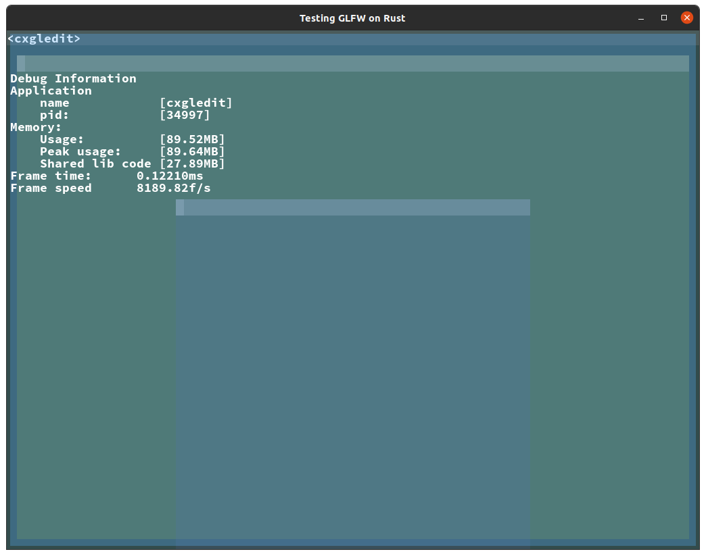

# cxgledit
So what's this? Well this is cxgledit rewritten in rust, because I'd figured it would be more fun to write in Rust. And oh boy yes it is.

So far, only some 60-70% of the same features as the C++ version, with some minor differences.

Key-bindings are not re-mappable right now, but obviously will be
- Ctrl + D:             Debug interface - show memory usage, frame time, fps, pid etc... more to come here
- Ctrl + N:             New view & Buffer
- Ctrl + Tab:           Cycle focused tab
- Ctrl + F1:            Debug dump a rust source file to active buffer
- Ctrl + End:           Go to end of file
- Ctrl + Home:          Go to beginning of file
- Ctrl + Left/Right:    Navigate cursor on word boundaries
- Ctrl + P:             Show popup view (no other functionality than a normal view as of now)

## Screenshots

Editing while having 2 views open

Debug interface overlaid on the window, and the popup window also displayed
