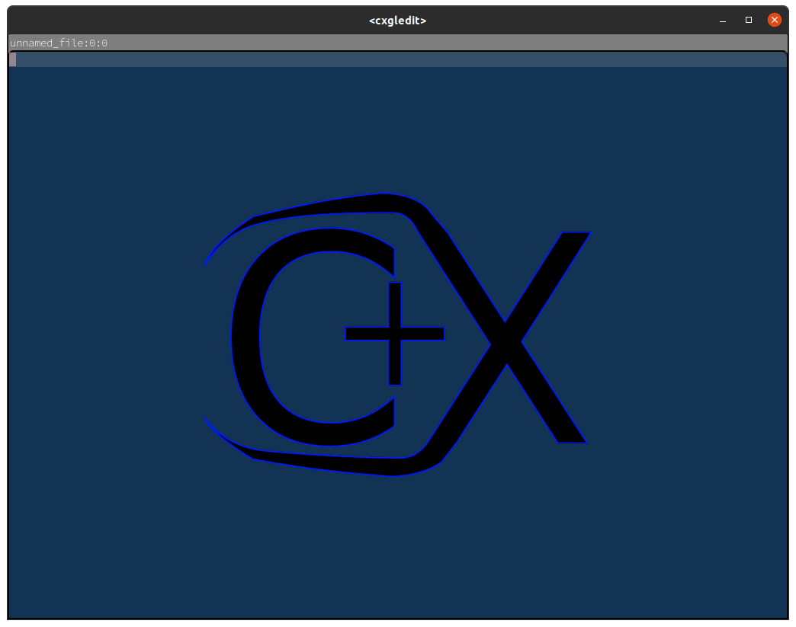
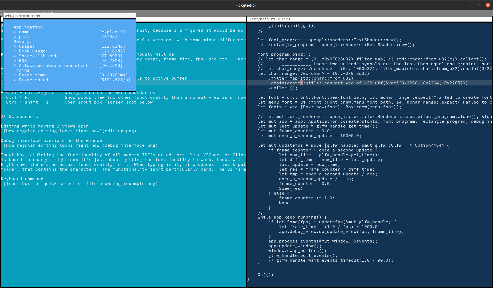
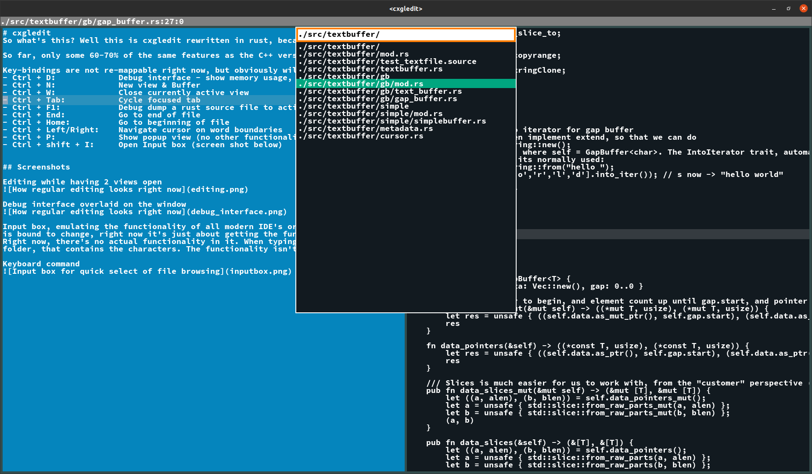

# cxgledit
So what's this? Well this is cxgledit rewritten in rust, because I'd figured it would be more fun to write in Rust. And oh boy yes it is.

So far, only some 60-70% of the same features as the C++ version, with some minor differences.

Key-bindings are not re-mappable right now, but obviously will be
- Ctrl + D:             Debug interface - show memory usage, frame time, fps, pid etc... more to come here
- Ctrl + N:             New view & Buffer
- Ctrl + W:             Close currently active view
- Ctrl + Tab:           Cycle focused tab
- Ctrl + F1:            Debug dump a rust source file to active buffer
- Ctrl + End:           Go to end of file
- Ctrl + Home:          Go to beginning of file
- Ctrl + Left/Right:    Navigate cursor on word boundaries
- Ctrl + P:             Show popup view (no other functionality than a normal view as of now)
- Ctrl + shift + I:     Open Input box (screen shot below)

## Code quality
I have to be very clear and say that the quality of this code, how it's designed, is particularly awful. That mostly has to do with my inexperience
with writing applications that deal directly with OpenGL. Therefore most of the stuff becomes hack and slash (and I do mean, wild, hack and slash) to
get it working, and once I've done that, start thinking about architecturing the design. (one example of this hack-n-slash-then-design, is what I
did with DrawCommandList in [the polygon renderer](src/opengl/rectangle.rs))

### Todos
- [ ] Implement rudimentary Rust syntax highlighting (use regex crate. For whatever reason, regex seem to outperform naive approaches, so might as well use that).
- [ ] Todo source code parser. Scan documents for todo comments and present them in some nice way

## Screenshots

Empty file

Editing while having 2 views open

Debug interface overlaid on the window

Input box, emulating the functionality of all modern IDE's or editors, like VSCode, or Clion etc. The design
is bound to change, right now it's just about getting the functionality to work. Looks will come later.
Right now, there's no actual functionality in it. When typing in it, it produces files & paths in the workspace
folder, that contains the characters. The functionality isn't particularly hard. The UI is my absolute weakest side.

Keyboard command
